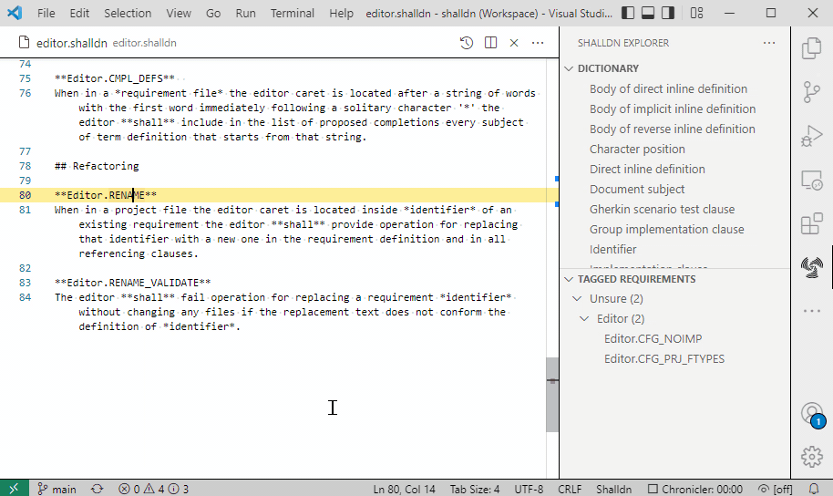
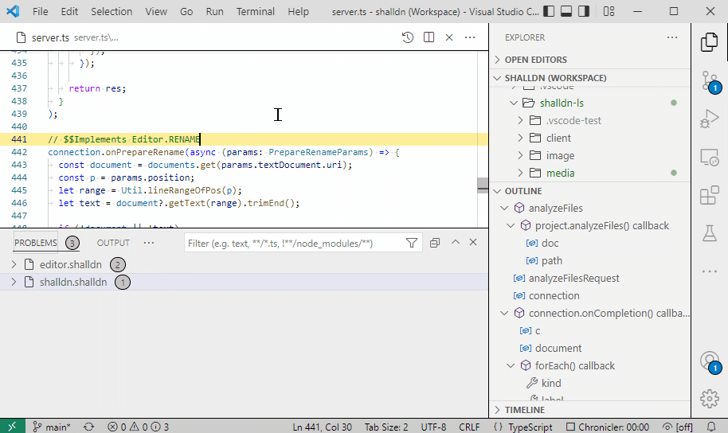
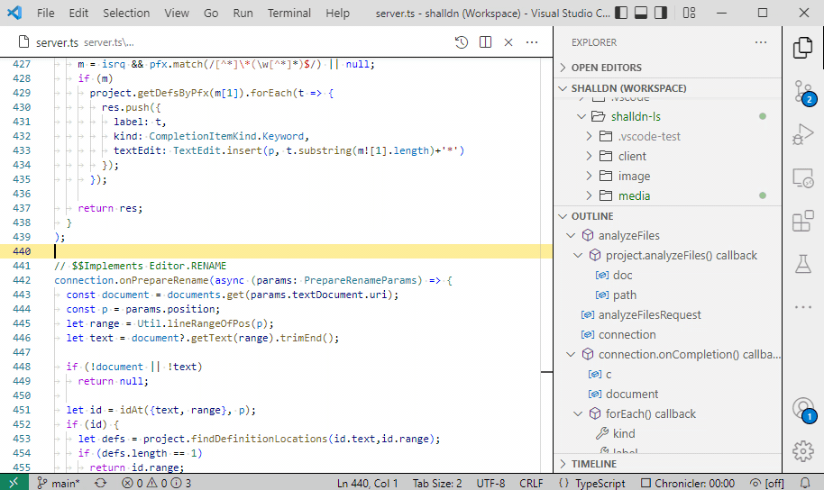

# Shalldn language server

Shalldn is a formal language for creating requirements. The Shalldn language server extension provides functionalities to create and manage projects based on requirements written in Shalldn.

The extension is part of the [Shalldn project](http://shalldn.net), which also includes specifications for the Shalldn language. Both the extension and language specifications are work in progress.

## Short introduction to Shalldn language

The Shalldn language is defined by collection of restrictions on the natural **English** language and as such is a subset of the natural English language. Additionally, Shalldn uses punctuation rules based on Markdown to attach a special meanings to parts of the text.

In order for tools to recognize a Markdown text as a Shalldn document the file has to have name extension shalldn.

The formal requirement in Shalldn is a one-sentence statement with the subject of the requirements document followed by bolded word **shall**. Bolded in Markdown means surrounded with double asterisks: ```**shall**```. It is an error to have multiple bolded **shall**'s in a single sentence, or have **shall** after text that is not the subject of the document.

The subject of the document is a single *italicized* group of words in the first line of the document. Italicizing is marked by surrounding words with single asterisks: ```*subject*```. The first line is usually a title with a heading markup: starting a line with sharp '#'. It is an error to have a .shalldn document without valid subject definition.

Each requirement must have a unique identifier, that may contain alpha-numeric characters and dots. the identifier must immediately precede the requirement sentence and be bolded. It is an error to have a requirement sentence without identifier or with non-unique identifier.

The requirement identifiers are used to link requirements on different levels of design be that lower level requirements, implementing code or test cases. In Shalldn documents linkage is established with *implementation clause*: a bulleted line after a requirement starting with the word 'Implements' followed by one or more bolded requirement identifiers, separated by commas. Bulleting is marked by starting the line with an asterisk. In any other file the clause is usually put in a comment starting with keyword '$$Implements' followed by comma-separated list of requirement identifiers.

With the above description in mind, here is a complete valid Shalldn document:

|Source|Rendered Markdown|
|------|------|
|<code># An example *document*<br><br>`**Example.CNTNT**`  <br>An example document `**shall**` contain at least one instance of text illustrating the example.<br>* Implements `**COMMON_SENSE**`</code>|<H2>An example *document*</H2><br>**Example.CNTNT**  <br>An example document **shall** contain at least one instance of text illustrating the example.<br><ul><li> Implements **COMMON_SENSE**|

## Extension functionality

The language server currently provides the following features:

### Navigation 
The extension provides navigation through requirement IDs. Control-click on id to open defining requirement or jump upper level (justification) or lower level (implementation) requirements,  to implementation or test for that requirement. 



### Problem highlights
The extension highlights Shalldn problems with squiggly lines in text and lists them in "Problems" window, similar to compile errors for programming languages.

For .shalldn files problems include language syntax violations and project-wide problems, such as missing implementation for a requirement. For all other types of files in the project problems are limited to invalid *implementation clause*s such as including an identifier for non-existent requirement.



### Editing completion
The extension provides typing completions for keywords and requirement IDs both in .shalldn requirements files and other language files.



### Refactoring
The extension assist in renaming requirement IDs in definitions and all references.


### Tagging
The extension support tagging individual requirements for various tracking purposes, such as status or change requests. Navigator window allows quick overview of tageed requirements.


## Complete example
In order to test all available features of the extension you can download the [source code of Shalldn project from GitHub](https://github.com/vldmr-bus/shalldn), which contains a set of Shalldn specification traceable to source code of the extension.